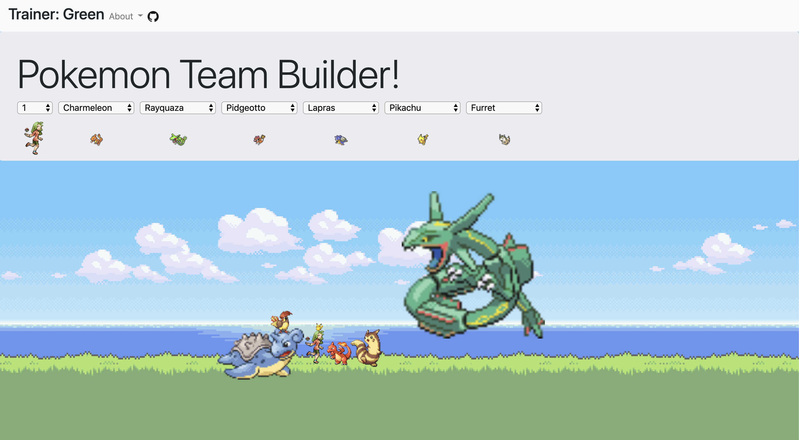

# PokeTeamBuilder

Ever wanted an easy way to tell how big your favourite team of Pokémon is compared to you? Pokémon Team Builder is a single page JavaScript application (with a Rails API as a back-end) where users can create a trainer and select up to 6 Pokémon from generations 1-3 that will appear (mostly) sized according to their Pokédex height. Pokémon and trainers can then be dragged around on a background to create a team picture. Pokémon, trainer sprites, and positions are saved, and reloaded upon login.

## Installation

1. Fork the repository
2. Clone the files to your computer
3. Navigate to `PokeTeamBuilder/poketeam-builder-api` in your terminal
4. Run `bundle install`
5. Run `rails db:migrate`
6. Run `rails db:seed`. This step is very important as it loads Pokémon and trainer sprites into the app!
7. Run `rails s`
8. Open `PokeTeamBuilder/frontend/index.html` in your browser of choice

## Usage Example

## Sources
This app's Rails API makes use of Pokémon data from [PokéAPI](https://pokeapi.co/), pulled into the API database on `rails db:seed` using the [REST Client](https://github.com/rest-client/rest-client) gem

## Contributing
Pull requests are welcome. For major changes, please open an issue first to discuss what you would like to change.

## License
[MIT](https://choosealicense.com/licenses/mit/)

